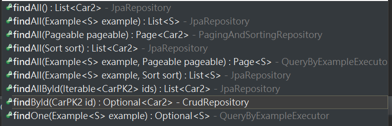

# 10. Spring Boot with Jsp View
在 Spring Boot 專案中要使用 jsp 作為前端畫面的話，需要先在 `application.properties` 中加入一些設定，`pom.xml` 中加入 jsp 的 dependency：

```properties
spring.mvc.view.prefix = /WEB-INF/jsp/
spring.mvc.view.suffix = .jsp
```

```xml
<!-- 在jsp中可以使用jstl -->
<dependency>
    <groupId>javax.servlet</groupId>
    <artifactId>jstl</artifactId>
</dependency>

<!-- 解析jsp -->	
<dependency>
    <groupId>org.apache.tomcat.embed</groupId>
    <artifactId>tomcat-embed-jasper</artifactId>
    <scope>provided</scope>
</dependency>
```

在 JavaEE 中，原本 jsp 頁面都是放在 

在src->main->webapp下新增WEB-INF資料夾
在WEB-INF資料夾新增jsp

```
|--src/main/java
|--src/main/test
|--src/resource
|--src/main/webapp // 新增的 source folder
   |--WEB-INF // 新增的 folder
      |--jsp // 新增的 folder
```

```
|--src/main/java
|--src/main/test
|--src/resource
|--src/main/webapp // 新增的 source folder
   |--WEB-INF // 新增的 folder
      |--jsp // 新增的 folder
```

```java
createTransactionIfNecessary();
try {
    callMethod();
    commitTransactionAfterReturning();
} catch (exception) {
    completeTransactionAfterThrowing();
    throw exception;
}
```

`@Transactional` 這個 Annotation 可以被放不同的地方，且具有繼承關係的 Interface 及 Class都具有相同效力：
1. Class 
2. Class method
3. Interface
4. Interface Method

在使用的時候需要注意的是，`@Transactional` 標註會依照某些優先順序，來看這個方法或是類別需不需要做交易控制，簡單來說順序如下：

```
Interface < Superclass < Class < Interface method < Superclass method < Class method
```

不過如果該方法是 `private` 或是 `protected`，Spring 會直接忽略掉 `@Transactional` 這個標註。

```java
@Entity
@Table(name = "CARS")
@IdClass(value = CarPKEntity.class)
public class CarEntity {
	@Id
	@Column(name = "MANUFACTURER")
	private String manufacturer;

	@Id
	@Column(name = "TYPE")
	private String type;

	@Id
	@Column(name = "SERIES")
	private String series;

	@Column(name = "MIN_PRICE")
	private BigDecimal minPrice;

	@Column(name = "PRICE")
	private BigDecimal price;

	public String getManufacturer() {
		return manufacturer;
	}

	public void setManufacturer(String manufacturer) {
		this.manufacturer = manufacturer;
	}

	public String getType() {
		return type;
	}

	public void setType(String type) {
		this.type = type;
	}

	public String getSeries() {
		return series;
	}

	public void setSeries(String series) {
		this.series = series;
	}

	public BigDecimal getMinPrice() {
		return minPrice;
	}

	public void setMinPrice(BigDecimal minPrice) {
		this.minPrice = minPrice;
	}

	public BigDecimal getPrice() {
		return price;
	}

	public void setPrice(BigDecimal price) {
		this.price = price;
	}
}
```

```java
@Repository
public interface CarRepository2 extends JpaRepository<Car2, CarPK2>{

}
```

再來新增一個 `CarPK2.java` ，用來告訴 Spring Boot 這個 Table 有三個複合主鍵，並修改 `hashCode()` 及 `equals()` 兩個方法的內容。

```java
@Embeddable
public class CarPKEntity {

    @Id
    @Column(name = "MANUFACTURER")
    private String manufacturer;

    @Id
    @Column(name = "TYPE")
    private String type;

    @Id
    @Column(name = "SERIES")
    private String series;

    public String getManufacturer() {
        return manufacturer;
    }

    public void setManufacturer(String manufacturer) {
        this.manufacturer = manufacturer;
    }

    public String getType() {
        return type;
    }

    public void setType(String type) {
        this.type = type;
    }

    public String getSeries() {
        return series;
    }

    public void setSeries(String series) {
        this.series = series;
    }

    @Override
    public int hashCode() {
        final int prime = 31;
        int hash = 17;
        hash = hash * prime + this.manufacturer.hashCode();
        hash = hash * prime + this.type.hashCode();
        hash = hash * prime + this.series.hashCode();
		
        return hash;
    }

    @Override
    public boolean equals(Object other) {
        if (this == other) {
            return true;
        }

        if (!(other instanceof CarPKEntity)) {
            return false;
        }

        CarPKEntity castOther = (CarPKEntity) other;

        return this.manufacturer.equals(castOther) 
            && this.type.equals(castOther.type) 
            && this.series.equals(castOther.series);
    }
}
```

最後要修改的部分是 Controller，當需要依 PK 做查詢的時候，可以使用 Repository 的 `findById()`。這邊我們只做測試，就不建立 Service 及 ServiceImpl 兩個 Interface 及 Class。下途中可以看到 `findById()` 方法需要傳入 PK，所以以這個例子來說，會傳入 `CarPK2.java` 的實例物件；若是單一主鍵的話，就傳入與該主鍵型別相同的參數就可以了。



那在 Controller 中要做的事情就是將 Request Body 內的內容裝到 `CarPK2.java` 中，並將它作為傳入參數餵給 `findById()`。

```java
@RestController
public class CarController {

    @Autowired
    private CarRepository2 carRepository2;

    public Optional<Car2> findById(@RequestBody RequestEntity<Car2> requestEntity) {

        Car2 car2 = requestEntity.getBody();

        CarPK2 carPK2 = new CarPK2();
        carPK2.setManufacturer(car2.getManufacturer());
        carPK2.setType(car2.getType());
        carPK2.setSeries(car2.getSeries());

        return carRepository2.findById(carPK2);
    }
}
```

這樣就可以使用多個複合主鍵查詢，如果只要使用其中幾個的話，就必須要參照 Repository 的命名規則。
<br/>

## 參考
https://www.objectdb.com/java/jpa/entity/id 
https://blog.csdn.net/sbin456/article/details/53304148 