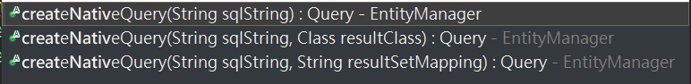
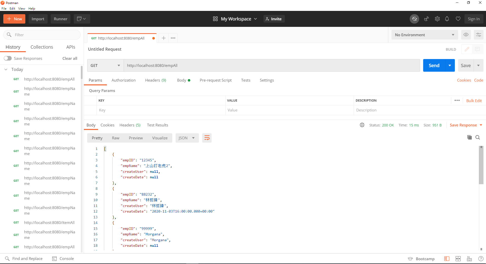

# 8.1. JPQL簡介 & 簡單查詢
提到 JPQL 前，我們先複習⼀下 JPA 是什麼。JPA不是⼀種框架，⽽是SUN公司推出的⼀套**基於 ORM ( object-relational mapping ) 的標準規範及接⼝ ( API )**。

也就是說 JPA 內會提供一些抽象類別，要用 Java 實現 ORM 框架，就必須依照 JPA 的規範以及實作這些抽象類。由於 JPA 是一個開源的 API ，所以會看到有許多廠商 ( Provider ) 推出自己的 ORM 框架，常見的有：Hibernate、Spring Data JPA等等，這些框架會基於 JPA 規範幫我們實作一些抽象類別實例，例如等一下會操作到的 `Query` 物件。

整體的架構將會如下：


而 JPQL 是 JPA 規範內定的其中一個**查詢語言規範**，JPQL 有兩個比較重要的特色：

1. 針對 Entity 做操作，不是直接對資料庫做操作
2. 可以讓使用者輸入較複雜的 SQL 原生語法進行查詢，如 `join`等

JPA 會將這些 SQL 轉成 JPQL 語法，這也是為什麼前面我們可以不需要寫 SQL 就可以進行簡單的查詢、新增等動作。

如果想要使用較複雜的 SQL，則可透過 JPA 提供的 `EntityManager`、`Query` 物件來達成。

<font color="red">他們之間的關係大致上如下圖：</font>

<br/>

接下來就要嘗試使用 JPQL 來進行對資料庫的操作。先用簡單的 SQL 查詢語句來查詢，我們需要新增2個檔案：`EMPController.java` 及 `SqlAction.java`，架構如下：

```
|--com.example.demospringboot
   |--DemospringbootApplication.java
|--com.example.demospringboot.configuration
   |--SwaggerConfig.java
   |--RestConfiguration.java
|--com.example.demospringboot.controller
   |--TestController.java
   |--ProductController.java
   |--EmpController.java // 新增的檔案
|--com.example.demospringboot.entity
   |--Car.java
   |--CarPK.java
|--com.example.demospringboot.model
   |--Product.java
|--com.example.demospringboot.repository
   |--CarRepository.java
|--com.example.demospringboot.service
   |--CarService.java
   |--ProductService.java
|--com.example.demospringboot.service.impl
   |--CarServiceImpl.java
   |--ProductServiceImpl.java
|--com.example.demospringboot.service.sql
   |--SqlAction.java // 新增的檔案
```
在這個範例中，我們會使用簡單的查詢語法來練習。首先新增 `SqlAction.java`，這支 Class主要是拿來建立原生 SQL。透過 `EntityManager` 的 `createNativeQuery()` 方法建立 `Query` 物件，`createNativeQuery()` 有三種不同的多載方法，這裡我們使用第一種，只需要傳入 SQL 語句即可。



若要取得查詢結果，可以使用 `Query` 物件的 `getResultList()` 方法，該方法會將結果封裝成 List 物件並回傳。

```java
@Configuration
public class SqlAction {

    @Autowired
    private EntityManager entityManager;

    public <T> List<T> queryForList() {
        Query query = entityManager.createNativeQuery("select * from STUDENT.TB_EMP");
        return query.getResultList();
    }
}
```

接下來建立 `EmpController.java`：

```java
@RestController
public class EmpController {

    @Autowired
    private SqlAction sqlAction;

    /**
     * 簡單查詢
     * @return
     */
    @RequestMapping(value = "/empName", method = RequestMethod.GET)
    public <T> List<T> queryEmpName() {
        return sqlAction.queryForList();
    }
}
```

最後在Postman進行測試，就可以拿到所有員工姓名資料。


但是這樣拿到的資料會失去欄位名稱，只有顯示查詢結果資料值，如果想要讓資料格式含有欄位值，我們可以建立 `Emp.java` 設定回傳資料的格式。

```
|--com.example.demospringboot
   |--DemospringbootApplication.java
|--com.example.demospringboot.configuration
   |--SwaggerConfig.java
   |--RestConfiguration.java
|--com.example.demospringboot.controller
   |--TestController.java
   |--ProductController.java
   |--EmpController.java
|--com.example.demospringboot.entity
   |--Car.java
   |--CarPK.java
   |--Emp.java // 新增的檔案
|--com.example.demospringboot.model
   |--Product.java
|--com.example.demospringboot.repository
   |--CarRepository.java
|--com.example.demospringboot.service
   |--CarService.java
   |--ProductService.java
|--com.example.demospringboot.service.impl
   |--CarServiceImpl.java
   |--ProductServiceImpl.java
|--com.example.demospringboot.service.sql
   |--SqlAction.java // 修改的檔案
```
先建立 `Emp.java`：

```java
@Entity
@Table(name = "TB_EMP")
public class Emp implements Serializable {
    private static final long serialVersionUID = 1L;

    @Id
    @Column(name = "EMP_ID")
    private String empID;

    @Column(name = "EMP_NAME")
    private String empName;

    @Column(name = "CREAT_USER")
    private String createUser;

    @Column(name = "CREAT_DATE")
    private Timestamp createDate;

    public String getEmpID() {
        return empID;
    }

    public void setEmpID(String empID) {
        this.empID = empID;
    }

    public String getEmpName() {
        return empName;
    }

    public void setEmpName(String empName) {
        this.empName = empName;
    }

    public String getCreateUser() {
        return createUser;
    }

    public void setCreateUser(String createuser) {
        this.createUser = createuser;
    }

    public Timestamp getCreateDate() {
        return createDate;
    }

    public void setCreateDate(Timestamp createDate) {
        this.createDate = createDate;
    }

}
```
接著修改一下 `SqlAction.java` 的`createNativeQuery()`方法，指定查詢回傳結果的 Class 是 `Emp` 實體。

```java
@Configuration
public class SqlAction {

    @Autowired
    private EntityManager entityManager;

    public <T> List<T> queryForList() {
        // 多加一個傳入參數 Emp.class
        Query query = entityManager.createNativeQuery("select * from STUDENT.TB_EMP", Emp.class);
        return query.getResultList();
    }
}
```

測試後可以看到回傳資料就會依照 `Emp` 內規定的格式回傳。




## 其他
<font color="red">
   Hibernate 到底有沒有實作 EntityManager? <br>
</font>

## 參考

https://openhome.cc/Gossip/EJB3Gossip/Query.html 
https://docs.oracle.com/javaee/6/api/javax/persistence/Query.html
https://docs.oracle.com/javaee/7/api/javax/persistence/EntityManager.html#createNativeQuery-java.lang.String-java.lang.Class-

