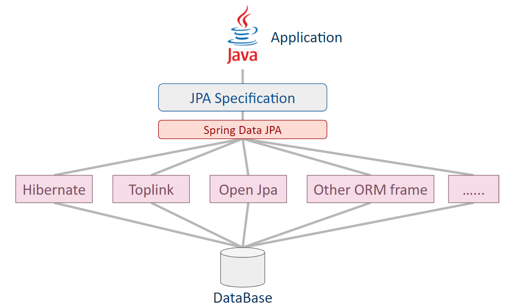

# JPA & JPQL
## JPA ( Java Persistence API )
JPA不是一種框架，而是SUN公司推出的一套基於 ORM ( object-relational mapping ) 的準規範及接口 ( API )。

JPA 通過註解 ( annotation ) 如：`@Entity`、`@Table`、`@Column` 等註解，或 XML 描述物件－關係表的對映關係，並將執行期的實體物件持久化到資料庫中。

要使用 JPA 的功能就需要 Provider 來配合，而 Provider 就是各種 ORM 框架，所以在 JPA 底下其實有各種 ORM 框架可以選擇，如：Hibernate。

 

## JPQL
那麼 JQPL 又是什麼呢？JPA定義了獨特的JPQL ( Java Persistence Query Language )，語法可類似 SQL，有以下幾個特點：
* 它是針對實體 ( Entity ) 的一種查詢語言
* 操作對象是實體，而不是資料庫

JPA是獨立於SQL ，基於JDBC之上的抽象層。所有類和註解都在javax.persistence包中。

因為Entity的名稱預設為實體的類別名稱，所以查詢的是Employee而不是EMPLOYEE。

> 補充
* JPA的出現有兩個原因：
    1. 簡化現有 Java EE 和 Java SE 應用的物件持久化的開發工作。
    2. Sun 希望整合對 ORM 技術，實現持久化領域的統一。
 

* Spring Data JPA
不是 JPA 而是一種技術/模組 ( module )。

   > Spring Data JPA makes it easy to  easily implement JPA based repositories. This module deals with enhanced support for JPA based data access layers.

   目的是支援 JPA 的數據訪問層 ( Data Access Layer )，以精簡及減少編寫SQL代碼來改善開發者的開發效率。

   其關係如下：

   

> 參考資料
https://ithelp.ithome.com.tw/articles/10217348 
